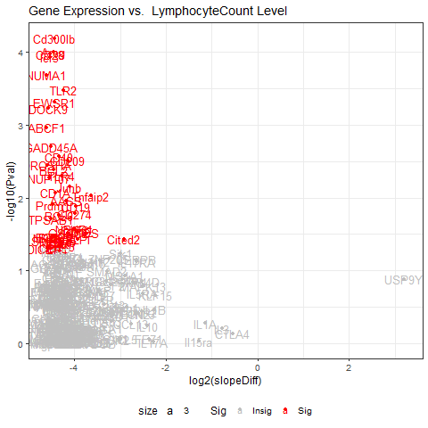
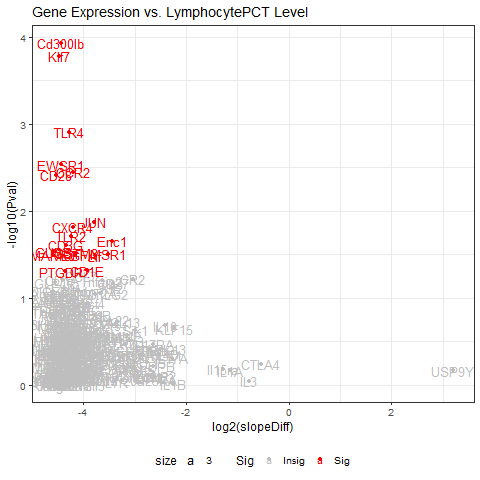

## Analyze Lymphocytes:
 by Hana G Velecina

## Introduction
This project is about comparing data sets of BMI and Lymphocytes vs BMI and Lymphocytes_PCT contained in a csv file to model the relationships between each other. 

### Table of Contents:

- [What is a Lymphocyte](document/what_is_lymphocyte.md)
- #### Results of statistical analysis

     - [High and Low Bounds](document/high_and_low_bound.md)

     - Single regression
          - [BMI x Lymphocytes scatterplot](document/bmi_lymphocyte_scatter.md)
          - [BMI x Lymphocytes boxplot](document/bmi_lymphocyte_boxplot.md)
          - [BMI x Lymphocytes_PCT scatterplot](document/bmi_lymphocyte_pct_scatter.md)
          - [BMI x Lymphocytes_PCT boxplot](document/bmi_lymphocyte_pct_boxplot.md)
          

### R Scripts

[Lymphocytes.R](scripts/Analyze-Lymphocytes.R) will allow you to load a comma-delimited .csv with various datapoints, perform single regressions of Body Mass Index (BMI) vs. Lymphocytes from the Complete Blood Count with Differential (CBC-D) results, and produce 2-D scatterplots, and boxplots for the results.

[Lymphocytes_PCT.R](scripts/Analyze-Lymphocytes_PCT.R) 
will allow you to load a comma-delimited .csv with various datapoints, perform single regressions of Body Mass Index (BMI) vs. Lymphocytes_PCT from the Complete Blood Count with Differential (CBC-D) results, and produce 2-D scatterplots, and boxplots for the results.

#### Input Data Set: 
[RobinsonEtAl_Sup1.csv](data/RobinsonEtAl_Sup1.csv)

## Project BTEC395
### Transformations and Volcano Plots

The following scripts were intended to make statistical significance (P value) versus magnitude of change (fold change) using R of Lymphocytes and Lymphocytes_PCT:

[Analyze-LymphocytesProjectFinalProject.R](scripts/Analyze-LymphocytesFinalProject.R)

[Analyze-Lymphocytes_PCTFinalProject.R](scripts/Analyze-Lymphocytes_PCTFinalProject.R)

#### Volcano Plots

### What is Gene Ontology?

Gene Ontology is a formal representation of a body of knowledge within a given domain. Ontologies usually consist of a set of classes with relations that operate between them.

### Example Lymphocytes genes that were significant

- <b>AASS</b> - Aminoadipate-semialdehyde synthase
- <b>ABCF1</b> - ATP Binding Cassette Subfamily F Member 1
- <b>AKT3</b> - AKT serine/threonine kinase 3
- <b>Areg</b> - Amphiregulin
- <b>BCL2</b> - BCL2 Apoptosis Regulator
- <b>BCL6</b> - BCL6 transcription repressor

### Gene Significance for Lymphocytes_PCT

- <b>AASS</b> - Aminoadipate-Semialdehyde Synthase
- <b>ABCF1</b> - ATP Binding Cassette Subfamily F Member 1
- <b>AKT3</b> - AKT serine/threonine kinase 3
- <b>Areg</b> - Amphiregulin

#### Panther Analysis
All of the genes for Lymphocytes and Lymphocytes_PCT did not show any significant pathways in Pantherdb.org

