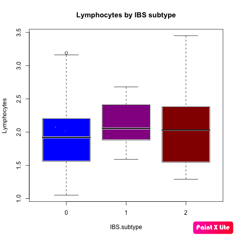
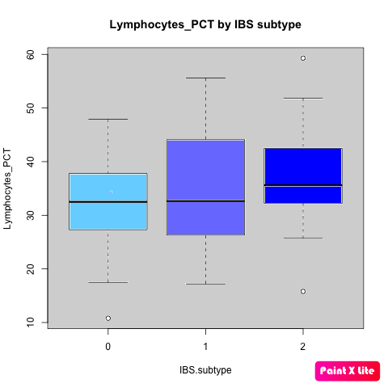

## AnalyzeLymphocytes:
 by Hana G Velecina


###Table of Contents:
- [What is a Lymphocyte](document/what_is_lymphocyte.md)
- Data
     -


### Single regressions scatterplots and boxplots for Lymphocytes and Lymphocytes_PCT.
([AnalyzeLymphocytes.R](scripts/Analyze-Lymphocytes.R))
will allow you to load a comma-delimited .csv with various datapoints, perform single regressions of Body Mass Index (BMI) vs. Lymphocytes and Body Mass Index (BMI) vs. Lymphocytes_PCT from the Complete Blood Count with Differential (CBC-D) results, and produce 2-D scatterplots, and boxplots for the results. 


## High and Low Bounds

IBS$Lymphocytes_result[IBS$Lymphocytes > 54] <- "HIGH"

IBS$Lymphocytes_result[IBS$Lymphocytes <= 19 & IBS$Lymphocytes >= 53] <- "NORMAL"

IBS$Lymphocytes_result[IBS$Lymphocytes < 18] <- "LOW"

##
### Results of single regression, BMI x Lymphocytes scatterplot
```
> ggplot(IBS, aes(x = BMI, y = Lymphocytes)) + geom_point() + geom_smooth(method = lm) 
> png("fig_output/Lymphocytes_scatterplot.png")
> Lymphocytes_scatterplot <- ggplot(IBS, aes(x = BMI, y = Lymphocytes)) + geom_point() + geom_smooth(method = lm) 
> print(Lymphocytes_scatterplot)

Call:
lm(formula = BMI ~ Lymphocytes, data = IBS1)

Coefficients:
(Intercept)  Lymphocytes  
     21.869        2.458 

```


##
### Results of single regression, BMI x Lymphocytes boxplot
```
> ggplot(IBS, aes(x = BMI, y = Lymphocytes)) + geom_point() + geom_smooth(method = lm) 
> png("fig_output/Lymphocytes_boxplot.png")
> Lymphocytes_boxplot <- ggplot(IBS, aes(x = BMI, y = Lymphocytes)) + geom_point() + geom_smooth(method = lm) 
> print(Lymphocytes_boxplot)

Call:
lm(formula = BMI ~ Lymphocytes, data = IBS1)

Coefficients:
(Intercept)  Lymphocytes  
     21.869        2.458

```




##
### Results of single regression, BMI x Lymphocytes_PCT scatterplot
```
> scatterplot(Lymphocytes_PCT ~ IBS.subtype, data = IBS, main="Lymphocytes_PCT by IBS subtype", xlab = "IBS.subtype", ylab = "Lymphocytes_PCT")
> png("fig_output/Lymphocytes_PCT_scatterplot.png")
> Lymphocytes_PCT_scatterplot <- scatterplot(Lymphocytes_PCT ~ IBS.subtype, data = IBS, main="Lymphocytes_PCT by IBS subtype", xlab = "IBS.subtype", ylab = "Lymphocytes_PCT")
> print(Lymphocytes_PCT_scatterplot)

Call:
lm(formula = BMI ~ Lymphocytes_PCT, data = IBS1)

Coefficients:
    (Intercept)  Lymphocytes_PCT  
       25.57843          0.03652  


```


##
### Results of single regression, BMI x Lymphocytes_PCT boxplot
```
> boxplot(Lymphocytes_PCT ~ IBS.subtype, data = IBS, main="Lymphocytes_PCT by IBS subtype", xlab = "IBS.subtype", ylab = "Lymphocytes_PCT")
> png("fig_output/Lymphocytes_PCT_boxplot.png")
> Lymphocytes_PCT_boxplot <- boxplot(Lymphocytes_PCT ~ IBS.subtype, data = IBS, main="Lymphocytes_PCT by IBS subtype", xlab = "IBS.subtype", ylab = "Lymphocytes_PCT")
> print(Lymphocytes_PCT_boxplot)

Call:
lm(formula = BMI ~ Lymphocytes_PCT, data = IBS1)

Coefficients:
    (Intercept)  Lymphocytes_PCT  
       25.57843          0.03652 

```



